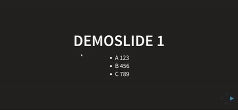

# Spotlight - Reveal.js Plugin

A plugin for [Reveal.js](https://github.com/hakimel/reveal.js) allowing to highlight the current mouse position with a spotlight. 

It is off by default and you can trigger it with a keyboard press.

## Demo

 

## Installation

### Copy
Copy the file `spotlight.js` into the plugin folder of your reveal.js presentation, i.e. ```plugin/spotlight```.


### Dependencies
Add the plugin to the dependencies in your presentation, as below. 

```javascript
Reveal.initialize({
	// ...
	dependencies: [
		// ... 		
		{ src: 'plugin/spotlight/spotlight.js' },
		// ... 
	]
});
```

## Configuration
The plugin can be configured by providing a spotlight option containing an object with `size` within the reveal.js initialization options. Furthermore you can configure the key which toggles the spotlight.

```javascript
Reveal.initialize({
	// ...
	spotlight: {
		  	size: 40
	},
	keyboard: {
			// toggle spotlight by pressing key 'c'
		  	67: function() { RevealSpotlight.toggleSpotlight() },
	},
	// ...	
```

### Configuration items
**size**
Configure the size of the spotlight

